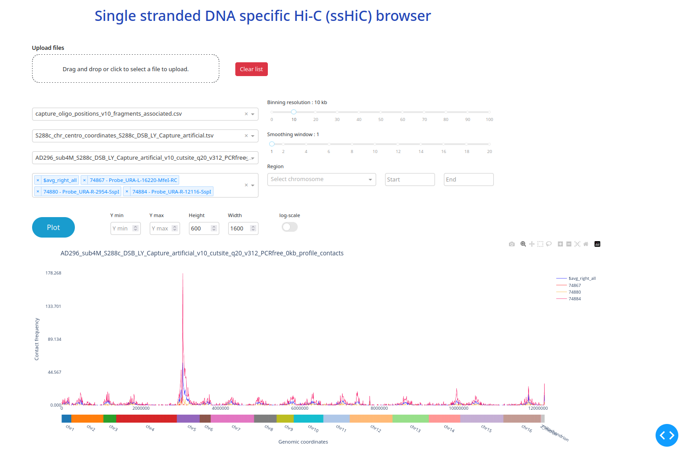

# sshicstuff: a pipeline for analyzing ssDNA-specific Hi-C data


## Dependencies  

It is recommended to use a virtual environment to install the dependencies. We suggest you to use the 
requirements.yml file to install a conda environment or mamba.

You can do it as follows:

```bash
mamba env create -f environment.yml
```

Activate the environment:
    
```bash
mamba activate sshicstuff
```

Inside the sshicstuff directory, install the package with the following command:

```bash
pip install -e .
```


## Description  
sshicstuff enables the analysis of ssDNA-specific Hi-C contact generated from paired-end Illumina reads. This project has not yet been packaged (coming soon). 
It includes multiples independents scripts which are executed one after the 
other according to the main script ```pipeline.py```. 
This pipeline is actually a downstream analysis extension of the HiC analysis pipeline hicstuff 
(https://github.com/koszullab/hicstuff). You can use it as follows:


## Usage

The sshicstuff command line interface is composed of multiple subcommands. 
You can always get a summary of all available commands by running:


```bash
Single Stranded DNA Hi-C pipeline for generating oligo 4-C profiles and aggregated contact matrices.

usage:
    sshicstuff [-hv] <command> [<args>...]

options:
    -h, --help                  shows the help
    -v, --version               shows the version

The subcommands are:
    subsample           Subsample and compress FASTQ file using seqtk.
    genomaker           Create a chromosome artificial that is the concatenation of the
                        annealing oligos and the enzyme sequence.
    associate           Associate oligo/probe name to fragment/read ID that contains it.
    hiconly             Keep only Hi-C reads from a sparse matrix file (i.e., remove all ssDNA reads).
    filter              Filter reads from a sparse matrix and keep only pairs of reads that 
                        contain at least one oligo/probe.
    coverage            Calculate the coverage per fragment and save the result to a bedgraph.
    profile             Generate a 4C-like profile for each ssDNA oligo.
    rebin               Rebin change binning resolution of a 4C-like profile
    stats               Generate statistics and normalization for contacts made by each probe.
    compare             Compare the capture efficiency of a sample with that of a wild type
                        (may be another sample).
    aggregate           Aggregate all 4C-like profiles on centromeric or telomeric regions.
    pipeline            Run the entire pipeline from filtering to aggregation.
    view                Open a graphical user interface to visualize 4-C like profile.
```


## Subcommands :

### Subsample

Subsample and compress FASTQ files using seqtk.

```bash
usage:
    subsample -i INPUT [-c] [-F] [-n SIZE] [-s SEED]

Arguments:
    -i INPUT, --input INPUT   Path to the input original FASTQ file (mandatory)

options:
    -c, --compress            Compress the output file with gzip [default: True]

    -F, --force               Force the overwriting of the output file if it exists [default: False]

    -n SIZE, --size SIZE      Number of reads to subsample [default: 4000000]

    -s SEED, --seed SEED      Seed for the random number generator [default: 100]
```

### Genomaker

Create a chromosome artificial that is the concatenation of the annealing oligos and the enzyme sequence.
Place the newly created chromosome at the end of the genome file.
Possible to concatenate additional FASTA files to the genome file.
You can specify the rules for the concatenation.


```bash
    usage:
        genomaker -e ENZYME -g GENOME -o OLIGO_ANNEALING [-a ADDITIONAL] [-f FRAGMENT_SIZE] [-l LINE_LENGTH]  [-s SPACER]

    Arguments:
        -e ENZYME, --enzyme ENZYME                                  Sequence of the enzyme

        -g GENOME, --genome GENOME                                  Path to the genome FASTA file

        -o OLIGO_ANNEALING, --oligo-annealing OLIGO_ANNEALING       Path to the annealing oligo positions CSV file (mandatory)

    options:
        -a ADDITIONAL, --additional ADDITIONAL                      Additional FASTA files to concatenate [default: None]

        -f FRAGMENT_SIZE, --fragment-size FRAGMENT_SIZE             Size of the fragments [default: 150]

        -l LINE_LENGTH, --line-length LINE_LENGTH                   Length of the lines in the FASTA file [default: 80]

        -s SPACER, --spacer SPACER              
```


### Associate

Simple and basic script to find and associate for each oligo/probe name  a fragment id from the fragment list generated by hicstuff.

```bash
usage:
    associate -f FRAGMENTS -o OLIGO_CAPTURE [-F]

Arguments:
    -f FRAGMENTS, --fragments FRAGMENTS                     Path to the fragments file generated by hicstuff (mandatory)

    -o OLIGO_CAPTURE, --oligo-capture OLIGO_CAPTURE         Path to the oligo capture file (mandatory)

Options:
    -F, --force                                             Force the overwriting of the oligos file even if
                                                            the columns are already present [default: True]
```


### Hiconly

Filter the sparse matrix by removing all the ss DNA specific contacts. Retain only the contacts between non-ss DNA fragments.

```bash
usage:
    hiconly -c OLIGOS_CAPTURE -m SPARSE_MATRIX [-o OUTPUT] [-n FLANKING_NUMBER] [-F]

Arguments:
    -c OLIGOS_CAPTURE, --oligos-capture OLIGOS_CAPTURE      Path to the oligos capture file (mandatory)

    -m SPARSE_MATRIX, --sparse-matrix SPARSE_MATRIX         Path to the sparse matrix file (mandatory)

Options:
    -o OUTPUT, --output OUTPUT                              Path to the output file

    -n FLANKING_NUMBER, --flanking-number NUMBER            Number of flanking fragments around the fragment
                                                            containing a DSDNA oligo to consider and remove
                                                            [default: 2]

    -F, --force                                             Force the overwriting of the file if
                                                            it already exists [default: False]
```

### Filter

Filter reads from a sparse matrix and keep only pairs of reads that contain at least one oligo/probe.

```bash
Filter reads from a sparse matrix and keep only pairs of reads that contain at least one oligo/probe.

usage:
    filter -f FRAGMENTS -c OLIGOS_CAPTURE -m SPARSE_MATRIX [-o OUTPUT] [-F]

Arguments:
    -c OLIGOS_CAPTURE, --oligos-capture OLIGOS_CAPTURE      Path to the oligos capture file

    -f FRAGMENTS, --fragments FRAGMENTS                     Path to the digested fragments list file

    -m SPARSE_MATRIX, --sparse-matrix SPARSE_MATRIX         Path to the sparse matrix file

Options:
    -o OUTPUT, --output OUTPUT                              Path to the output file

    -F, --force                                             Force the overwriting of the file if it exists [default: False]
```

### Coverage

Calculate the coverage per fragment and save the result to a bedgraph.

```bash
usage:
    coverage -f FRAGMENTS -m SPARSE_MAT [-o OUTPUT] [-F] [-N]

Arguments:
    -f FRAGMENTS, --fragments FRAGMENTS       Path to the fragments input file (mandatory)

    -m SPARSE_MAT, --sparse-mat SPARSE_MAT         Path to the sparse contacts input file (mandatory)

Options:
    -o OUTPUT, --output OUTPUT                          Desired output file path

    -F, --force                                         Force the overwriting of the output file if it exists [default: False]

    -N, --normalize                                     Normalize the coverage by the total number of contacts [default: False]`
```

### Profile

Generate oligo 4-C profiles, also known as un-binned tables or 0 kn resolution tables.

```bash
usage:
    profile -c OLIGO_CAPTURE -C CHR_COORD -f FILTERED_TAB  [-o OUTPUT] [-a ADDITIONAL] [-F] [-N]

Arguments:
    -c OLIGO_CAPTURE, --oligo-capture OLIGOS_CAPTURE       Path to the oligos capture file

    -C CHR_COORD, --chr-coord CHR_COORD                    Path to the chromosome coordinates file

    -f FILTERED_TAB, --filtered-table FILTERED_TAB         Path to the filtered table file

Options:
    -o OUTPUT, --output OUTPUT                             Desired output file path

    -a ADDITIONAL, --additional ADDITIONAL                 Additional columns to keep in the output file [default: None]

    -F, --force                                            Force the overwriting of the output file if it exists [default: False]

    -N, --normalize                                        Normalize the coverage by the total number of contacts [default: False]
```

### Rebin

Change the binning resolution of a 4C-like profile.

```bash
usage:
    rebin -b BINSIZE -c CHR_COORD -p PROFILE [-o OUTPUT] [-F]

Arguments:
    -b BINSIZE, --binsize BINSIZE                     New resolution to rebin the profile [default: 1000]

    -c CHR_COORD, --chr-coord CHR_COORD               Path to the chromosome coordinates file

    -p PROFILE, --profile PROFILE                     Path to the profile file (un-binned, 0 kb)

Options:
    -o OUTPUT, --output OUTPUT                        Desired output file path

    -F, --force                                       Force the overwriting of the output file if it exists [default: False]
```

### Stats

Generate statistics about the contacts made by each probe. Additionally, it generates
the normalized contacts for each probe on each chromosome and on each chromosome except its own.

It generates 3 outcomes files (.tsv):
- contacts_statistics.tsv: contains different kinds of statistics for each probe.
- norm_chr_freq.tsv: contains the normalized contacts for each probe on each chromosome.
- norm_inter_chr_freq.tsv: contains the normalized contacts for each probe on each chromosome except its own.

```bash
usage:
    stats -c OLIGO_CAPTURE -C CHR_COORD -m SPARSE_MAT -p PROFILE [-o OUTPUT] [-r CIS_RANGE] [-F]

Arguments:
    -c OLIGO_CAPTURE, --oligo-capture OLIGO_CAPTURE     Path to the oligos capture file

    -C CHR_COORD, --chr-coord CHR_COORD                 Path to the chromosome coordinates file

    -m SPARSE_MAT, --sparse-mat SPARSE_MAT              Path to the sparse contacts input file

    -p PROFILE, --profile PROFILE                       Path to the profile file (un-binned, 0 kb)


Options:
    -F, --force                                         Force the overwriting of the output file if the file exists [default: False]

    -o OUTPUT, --output OUTPUT                          Desired output directory

    -r CIS_RANGE, --cis-range CIS_RANGE                 Cis range to be considered around the probe [default: 50000]
```


### Compare

Compare capture efficiency of a sample with a wild-type reference.

```bash
usage:
    compare -s SAMPLE -r REFERENCE -n NAME [-o OUTPUT]

Arguments:
    -s SAMPLE, --sample-stats SAMPLE            Path to the sample statistics file
                                                (generated by the stats command)

    -r REFERENCE, --reference-stats REFERENCE   Path to the reference statistics file
                                                (generated by the stats command)

    -n NAME, --name NAME                        Name of the wt type reference

Options:
    -o OUTPUT, --output OUTPUT          Desired output directory
```


### Aggregate

Aggregate contacts around specific regions of centromeres or telomeres.

```bash
usage:
    aggregate -c OLIGO_CAPTURE -h CHR_COORD -p PROFILE [-o OUTPUT] [-C] [-E CHRS...] [-I] [-L] [-N] [-T] [-w WINDOW]

Arguments:
    -c OLIGO_CAPTURE, --oligo-capture OLIGO_CAPTURE     Path to the oligo capture CSV file

    -h CHR_COORD, --chr-coord CHR_COORD                 Path to the chromosome coordinates file

    -p PROFILE, --profile PROFILE                       Path to the profile .tsv file with the binning of your choice
                                                        (recommended 1kb for telomeres and 10kb for centromes)
Options:
    -C, --cen                                           Aggregate only centromeric regions [default: False]

    -E CHRS, --exclude=CHRS                             Exclude the chromosome(s) from the analysis

    -I, --inter                                         Only keep inter-chr contacts, i.e., removing contacts between
                                                        a probe and it own chr [default: True]

    -L, --arm-length                                    Classify telomeres aggregated in according to their arm length.

    -N, --normalize                                     Normalize the contacts by the total number of contacts
                                                        [default: False]

    -o OUTPUT, --output OUTPUT                          Desired output directory

    -T, --tel                                           Aggregate only telomeric regions [default: False]

    -w WINDOW, --window WINDOW                          Window size around the centromere or telomere to aggregate contacts
                                                        [default: 150000]
```

### Pipeline

Run the entire pipeline containing following steps:
- Filter
- HiC only
- Coverage (full and HiC only)
- Associate (probe <-> read)
- Profile
- Stats
- Rebin
- Aggregate (cen & telo)

```bash
usage:
    pipeline -c OLIGO_CAPTURE -C CHR_COORD -f FRAGMENTS -m SPARSE_MATRIX
    [-a ADDITIONAL_GROUPS] [-b BINNING_SIZES...] [-E CHRS...] [-F] [-I] [-L]
    [-n FLANKING_NUMBER] [-N] [-o OUTPUT] [-r CIS_RANGE]
    [--window-size-cen WINDOW_SIZE_CEN] [--window-size-telo WINDOW_SIZE_TELO]
    [--binning-aggregate-cen BIN_CEN] [--binning-aggregate-telo BIN_TELO]
    [--copy-inputs]


Arguments:
    -c OLIGO_CAPTURE, --oligo-capture OLIGO_CAPTURE     Path to the oligo capture file (.tsv/.csv)

    -C CHR_COORD, --chr-coord CHR_COORD                 Path to the chromosome coordinates file containing
                                                        the chromosome arms length and coordinates of centromeres

    -f FRAGMENTS, --fragments FRAGMENTS                 Path to the digested fragments list file (hicstuff output)

    -m SPARSE_MATRIX, --sparse-matrix SPARSE_MATRIX     Path to the sparse matrix file (hicstuff graal output)

Options:
    -a ADDITIONAL_GROUPS, --additional-groups ADDITIONAL_GROUPS
                                                        Path to the additional probe groups file

    -b BINNING_SIZES, --binning-sizes BINNING_SIZES     List of binning sizes to rebin the contacts
                                                        [default: 1000]

    -E CHRS, --exclude=CHRS                             Exclude the chromosome(s) from the analysis

    -F, --force                                         Force the overwriting of the output file if it exists
                                                        [default: False]

    -I, --inter                                         Only keep inter-chr contacts, i.e., removing contacts between
                                                        a probe and it own chr [default: True]

    -L, --arm-length                                    Classify telomeres aggregated in according to their arm length.

    -n FLANKING_NUMBER, --flanking-number NUMBER        Number of flanking fragments around the fragment
                                                        containing a DSDNA oligo to consider and remove
                                                        [default: 2]

    -N, --normalize                                     Normalize the coverage by the total number of contacts
                                                        [default: False]

    -o OUTPUT, --output OUTPUT                          Desired output directory

    -r CIS_RANGE, --cis-range CIS_RANGE                 Cis range to be considered around the probe
                                                        [default: 50000]

    --binning-aggregate-cen BIN_CEN                     Binning size of the aggregated profiles to use
                                                        for CENTROMERES

    --binning-aggregate-telo BIN_TELO                   Binning size of the aggregated profiles to use
                                                        for TELOMERES

    --copy-inputs                                       Copy inputs files for reproducibility [default: True]

    --window-size-cen WINDOW_SIZE_CEN                   Window size around the centromeres to aggregate contacts
                                                        [default: 150000]

    --window-size-telo WINDOW_SIZE_TELO                 Window size around the telomeres to aggregate contacts
                                                        [default: 15000]

```

### View

Open a graphical user interface to visualize 4-C like profile.

```bash
usage:
    view
```



### Plot

Plot a 4-C like profile.

```bash
usage:
    plot -p PROFILE -c OLIGO_CAPTURE -C CHR_COORD [-E CHRS...]
    [-h HEIGHT] [-L] [-o OUTPUT] [-r ROLLING_WINDOW] [-w WIDTH] [-y YMIN] [-Y YMAX]

Arguments:
    -c OLIGO_CAPTURE, --oligo-capture OLIGO_CAPTURE             Path to the oligo capture CSV file

    -C CHR_COORD, --chr-coord CHR_COORD                         Path to the chromosome coordinates file

    -p PROFILE, --profile PROFILE                               Path to the profile file (mandatory)


Options:

    -E CHRS, --exclude=CHRS                                     Exclude the chromosome(s)

    -h HEIGHT, --height HEIGHT                                  Height of the plot

    -L, --log                                                   Rescale the y-axis of the plot with np.log

    -o OUTPUT, --output OUTPUT                                  Desired output directory

    -r ROLLING_WINDOW, --rolling-window  ROLLING_WINDOW         Apply a rolling window to the profile

    -w WIDTH, --width WIDTH                                     Width of the plot

    -y YMIN, --ymin YMIN                                        Maximum value of the y-axis

    -Y YMAX, --ymax YMAX                                        Maximum value of the y-axis

```


## Mandatory files structure

You can refer to the `test_data.zip` archive in the `test_data` directory to see examples of the files structure.

#### Annealing Oligo file structure

Mandatory for the genomaker command.

```
chr             start   end     length   orientation	type   name             sequence_original   sequence_modified

chr_artificial  73      439     366      W              ss     Probe_URA-L-16220-MfeI  CGAT...TACCTGT   CGAT...TACCTGT
```

**chr :** chromosome location of the annealing oligo in the reference genome (fasta). May differ from its original position.
**start :** start position of the annealing oligo.
**end :** end position of the annealing oligo.
**length :** length of the annealing oligo.
**orientation :** orientation of the annealing oligo (W : Watson, C: Crick).
**type :** type of the annealing oligo (ss : single-stranded, ds: double-stranded).
**name :** name of the annealing oligo, also called probe. In general. 
it is composed of the distance from the DSB, L or R for left or right side of the DSB, and the restriction enzyme used.
**sequence_original :** original sequence of the annealing oligo.
**sequence_modified :** modified sequence of the annealing oligo including SNPs.


Extension : *`.csv`* (comma separator) 

#### Capture Oligo file structure

Similar structure as Annealing oligos file but used for the capture step of ssHiC. 

```

chr             start  end    chr_ori  start_ori	stop_ori  type	name 					sequence

chr_artificial  73     439    chr5     101544 		101623	  ss    Probe_URA-L-16220-MfeI  CGAT...TACCTGT 

```


**chr :** chromosome location of the annealing oligo in the reference genome (fasta). May differ from its original position.
**start :** start position of the annealing oligo.
**end :** end position of the annealing oligo.
**chr_ori :** original position of the oligo (not the artificial chromosome)
**start_ori :** position start of the oligo on the original chromsome.
**stop_ori :** positions stop of the oligo on the original chromosome.
**type :** for example ss or ds.
**name :** name of the capture oligo, also called probe. Same nomenclature as annealing. 
**sequence :** sequence of the capture oligo.


Extension : *`.csv`* (comma separator) 

#### Sparse matrix file structure

GRAAL sparse matrix: This is a simple tab-separated file generated by `hicstuff`with 3 columns: **frag1, frag2, contacts**. The id columns correspond to the absolute id of the restriction fragments (0-indexed). The first row is a header containing the number of rows, number of columns and number of nonzero entries in the matrix. Example:

```
564	564	6978
0	0	3
1	2	4
1	3	3
```


Extension *`.txt`* (tab separated)

#### Fragment file structure

This tab separated file provides information about restriction fragments positions, size and GC content. Note the coordinates are 0 point basepairs, unlike the pairs format, which has 1 point basepairs. Example:

```
id	chrom	start_pos	end_pos	size	gc_content
1	seq1	0	21	21	0.5238095238095238
2	seq1	21	80	59	0.576271186440678
3	seq1	80	328	248	0.5201612903225806
```

**id:** 1 based restriction fragment index within chromosome.
**chrom:** Chromosome identifier. Order should be the same as in info_contigs.txt or pairs files.
**start_pos:** 0-based start of fragment, in base pairs.
**end_pos:** 0-based end of fragment, in base pairs.
**size:** Size of fragment, in base pairs.
**gc_content:** Proportion of G and C nucleotide in the fragment.


Extension *`.txt`* (tab separated)

#### Chromosome coordinates file structure

This tab contains information about chromosome lengths and centromeres positions.

```
chr	length	left_arm_length	right_arm_length
chr1	230218	151465	78753
chr2	813183	238207	574976
```

Columns names are obviouse here.

***N.B. :*** 

Possibility to add a supplementary column in the case you want use the options

```-L, --arm-length                                    Classify telomeres aggregated in according to their arm length.``` in the pipeline. 

The column `category` will have the following structure :

```
category
small_small
middle_long
small_middle
```

with <size_type_left>_<size_type_right>

Extension *`.tsv`* (tab separated)

#### Additional probe groups file structure

If you want to aggregated multiple probe together by making an average, for instance of all the probes located onf the left distant strand from the break site. You must fill and give as argument this file.

```
name		             probes								           action
Average_left_noLY_pool2	     Probe_URA-L-15683-SspI-RC,Probe_URA-L-6065-SspI-RC,Probe_URA-L-3728-SspI-RC   average
Sum_left_noLY_pool2	     Probe_URA-L-15683-SspI-RC,Probe_URA-L-6532-MfeI-RC,Probe_URA-L-6065-SspI-RC   sum
```

**name :** name of your group of probes.
**probes :** concerned probes to put together.
**action :** the way you aggregate contacts of your group (*e.g.,* average, sum, median etc ...)

Extension *`.tsv`* (tab separated)


## Citation

Please cite sshicstuff and ssDNA specific Hi-C as follows :

> TODO : add DOI here


## Credit

hicstuff : Cyril Matthey-Doret, Lyam Baudry, Amaury Bignaud, Axel Cournac,  Remi-Montagne, Nadège Guiglielmoni, Théo Foutel Rodier and Vittore F.  Scolari. 2020. hicstuff: Simple library/pipeline to generate and handle  Hi-C data . Zenodo. http://doi.org/10.5281/zenodo.4066363


<div style="display: flex; flex-direction: row; align-items: center;">
  <p style="flex: 1;">We gratefully acknowledge support from the PSMN (Pôle Scientifique de Modélisation Numérique) of the ENS de Lyon for the computing resources</p>
  
</div>


